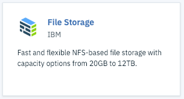
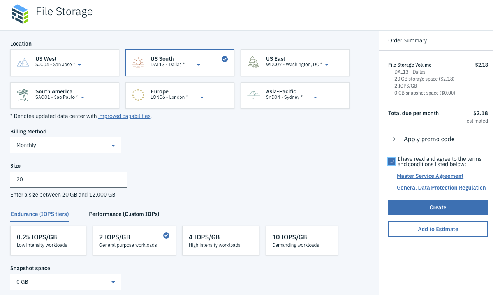
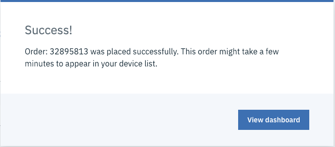
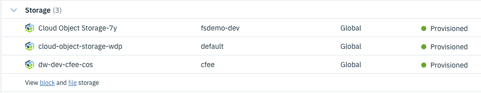
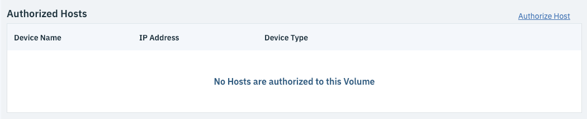
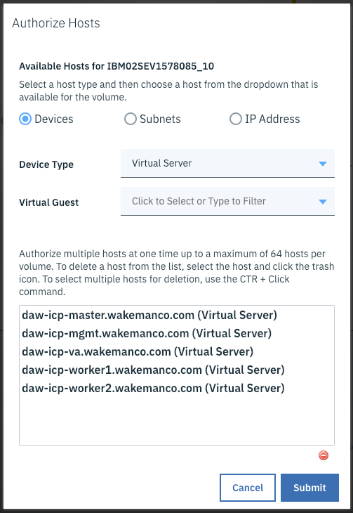
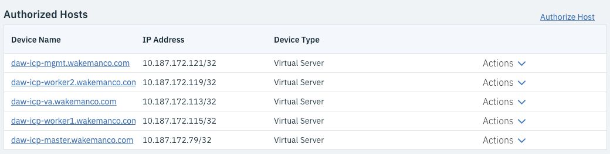
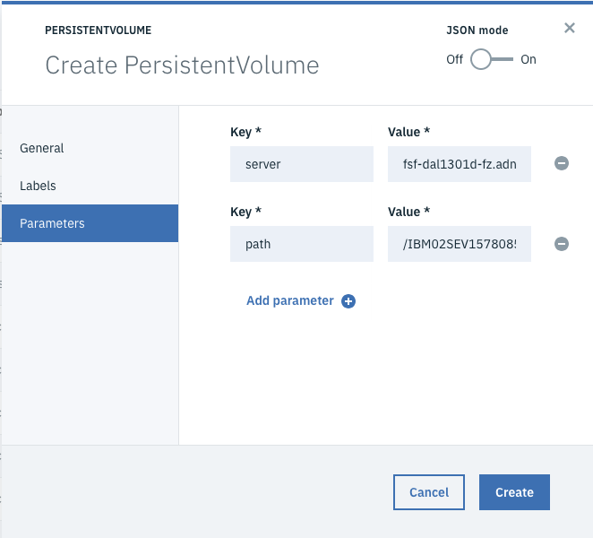
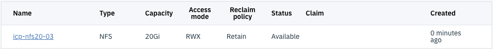

# Add NFS Storage to your cluster

## Create the File Storage Device in IBM Cloud

IBM Cloud has a File Storage service that you can use to create NFS volumes that can be added as persistent volumes in your ICP cluster.  To provision an NFS volume login to IBM Cloud and follow the steps below.

!!! note
    These instructions have only been tested with an IBM Cloud Private cluster hosted in virtual servers in IBM Cloud.

- Go to the catalog, navigate to the `Storage` category and click on the File Storage tile.

    

- Click the `Create` button.
- Select the appropriate region and (optionally) data center.

    

    !!! note
        In this example the default performance option is selected.  You can choose whatever you need.

- Click the check box to accept the terms and conditions, then click `Create`.  You should see a popup indicating that your order was placed.

    

- Click the button to view the dashboard.  The dashboard does not show file storage resources, so you will need to click the `file storage` link to see them.

    

    You should see a list of all your file storage devices.  If you have more than one the one you just created should be at the bottom of the list.

    !!! note
        If your device has not yet been provisioned you will see a little "clock" icon next to the name of the device.  In this case just refresh the page using the refresh icon in the table's toolbar until the clock icon goes away.

- Click on the name of your device to see its details.  Take note of the `Host Name` and `Mount Point` fields.  You will need them later to configure your persistent volume in Cloud Private.

- In order for Cloud Private to be able to access your newly created storage you must authorize the hosts on which your cluster is running.  If you scroll down on the device details page you will notice that by default no hosts are authorized.

    

- Click the `Authorize Host` link.  In the popup set the Device Type to `Virtual Server` (assuming you used virtual servers), then use the Virtual Guest dropdown to select each of your Cloud Private servers (one at a time).

    

- Click `Submit`.  You should now see all of your virtual servers listed in the Authorized Hosts table on the Device Details page.

    

This concludes the portion of the setup in IBM Cloud.

## Add Persistent Volume in IBM Cloud Private

Login to your Cloud Private Console.  

- In the left navigation menu expand the `Platform` category and click `Storage`.

- Click `Create Persistent Volume`.

- On the `General` tab give your volume a name.  Leave the `Storage class name` blank, set the `Capacity` field to the size of your file storage volume (20 GB by default, or whatever size you chose when you created the volume).  Select the appropriate `Access mode` that you wish to use for this volume.

- Click the Parameters tab.  For an NFS volume you have to add two parameters, named `Server` and `Path`, whose values are the host name and mount point you captured earlier on the Device Details page for your volume in IBM Cloud.

    !!! warning
        The Mount Point field will actually be of format `hostname:path`,  like this:

        `fsf-dal1301d-fz.adn.networklayer.com:/IBM02SEV1578085_10/data01`

        The value of path should be just the content after the `:`, like this:

        `/IBM02SEV1578085_10/data01`

    

- Click `Create`.  You should see your newly created persistent volume in the list.

    

That's it!  If the status is `Available` your persistent volume is ready for use.