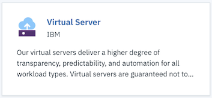
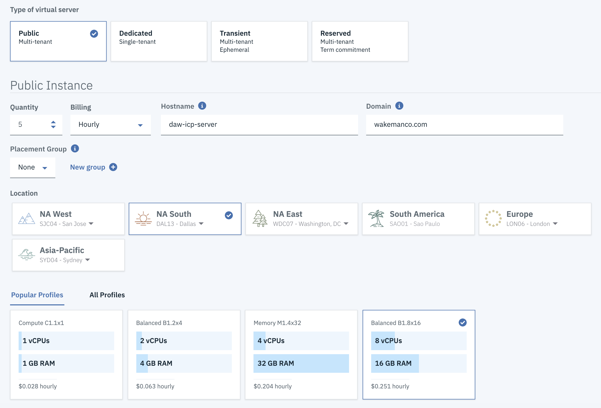
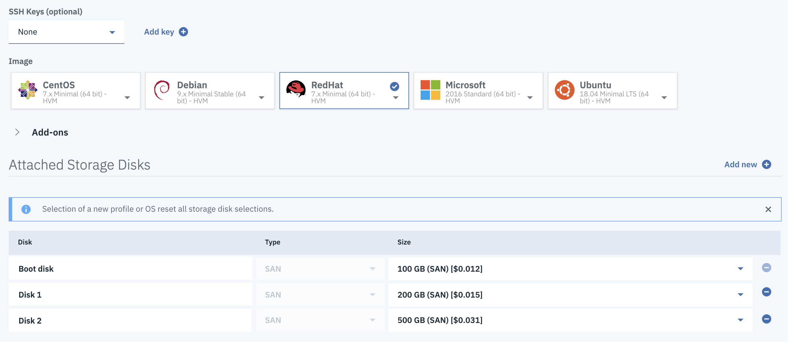
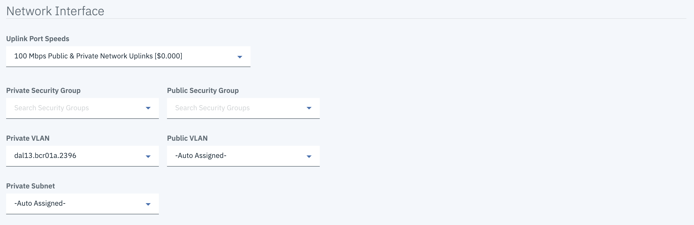

# Create the Virtual Machines

Provision 5 virtual machines with this configuration:

- RHEL Minimal (7.x)
- 8 CPU / 16G  Mem
- 100GB Boot Disk
- 200GB Disk 1
- 500GB Disk 2

!!! tip
    You can create all 5 VMs at the same time with the same configuration by using the `Quantity` field on the order page.

To create virtual machines:

- Login to your [IBM Cloud](https://cloud.ibm.com) account.
- Click the `Create Resource` button on the Dashboard page
- Click the Virtual Server tile.  

- Specify the following settings for your Virtual Server Instance:
    - The `Public Virtual Server` tile should be selected; click `Continue`.
    - Choose `Public` as the type of virtual server
    - Set the `Quantity` to `5`
    - Specify values for `Host Name` and `Domain`
    - Choose the location and data center of your choice
    - Choose the `Balanced B1.8x16` profile.  You many need to choose the `All Profiles` tab to find it.
    - Choose `Red Hat` as the Image (take the default `7.x Minimal (64-bit) - HVM`).  Make sure you actually cick the `Red Hat` box and that it has a blue outline and the blue checkmark.
    - In the `Attached Storage Disks` section, click the `Add New` button twice to create two new disks, named `Disk 1` and `Disk 2`
    - change the size of the disks:
        - `Boot Disk` to `100 GB`
        - `Disk 1` to `200 GB`
        - `Disk 2` to `500 GB`

When finished the screen should look like this:

- Click the checkbox to acknowledge that you have read and agree to the third party agreements and click `Create`.

!!! note
    These values for `host name` and `domain` do not have any affect on the actual host name and domain defined
    inside the virtual machines.  They are just labels and can be changed at any time.

!!! note
    When you chose a quantity greater than 1 your virtual machines may have an added sequence number in their host names.  Don't forget that you can change the names of your virtual machines after they are created. The name of your VM's in the IBM Cloud Infrastructure section are just for your own reference. It's best practice to name each of them with some indication on what role they will play in your cluster, such as (master, mgmt, worker, va, proxy)

!!! tip
    You will need to transfer a very large file to your `master` node.  Once your machines are created, you can initiate this transfer.  You will need to know the password for `root`, which you can get from the `Passwords` tab on the `Device Details` page.

    To transfer the file open a terminal window on your host machine, navigate to the directory where the file is stored and execute this command:

    `scp ibm-cloud-private-x86_64-3.1.1.tar.gz root@<your Master node IP>:/tmp`

    The scp command is the `Secure File Transfer` command. 

When your machines are provisioned it will be helpful for you to collect some information together that you will need later.  The table below is an example of what you should collect.  The hostnames can be whatever values you want.  The passwords are for the `root` user and can be obtained on the `Passwords` tab of the Details page for your device.

| Machine Role      | hostname       | IP Address      | Password |
| ----------------- | -------------- | --------------- | -------- |
| Master/Proxy/Boot | my-icp-master  | xxx.xxx.xxx.xxx | xxxxxxxx |
| Management        | my-icp-mgmt    | xxx.xxx.xxx.xxx | xxxxxxxx |
| VA                | my-icp-va      | xxx.xxx.xxx.xxx | xxxxxxxx |
| Worker1           | my-icp-worker1 | xxx.xxx.xxx.xxx | xxxxxxxx |
| Worker2           | my-icp-worker2 | xxx.xxx.xxx.xxx | xxxxxxxx |

!!! note
    I recommend you use the Public IPs for all your virtual machines. You can use the Private IP for everything except the PROXY node if you really want to, but you must be consistent in all the next steps for everything to work properly. 