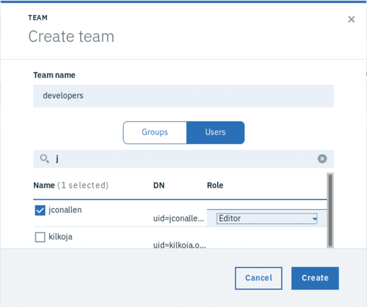

# Installing and Configuring LDAP

_**THANK YOU**  to Jim Conallen for contributing the following documentation!!_

Est. Time: 15 min.

!!! note
    The original directions for configuring LDAP written my Jim Conallen can be found [here](https://ibm.ent.box.com/s/6q6h74cdx5zkd0t7y2rhohaiujo99a4u).


## Introduction

This document describes how to use setup OpenLDAP on a Linux node that is either part of an ICP cluster, or has visibility to and from the cluster.  It uses the Docker image siji/openldap:2.4.42 which is a multi-arch image with an OpenLDAP server, and a web based administrative console.  This document describes how to install and setup a few users and groups that can then brought into ICP teams.

You can run the LDAP server on any one of the nodes, but I would suggest you run it either on the master or boot node. I choose to run this on a separate stand alone server. All it requires is that docker is installed.  

!!! warning
    If you plan in [Customizing the cluster access URL](https://www.ibm.com/support/knowledgecenter/en/SSBS6K_3.1.1/user_management/custom_url.html) you should configure that BEFORE you configure any LDAP connections.  

## Installation

The VM that will run OpenLDAP must have docker installed.  If it does not have visibility to DockerHub to directly pull the image siji/openldap:2.4.42, then you will have to save the image to a file and copy it image from another machine that does with the [docker image save](https://docs.docker.com/engine/reference/commandline/image_save/) and [docker image load](https://docs.docker.com/engine/reference/commandline/image_load/) commands.

To ensure persistence across reboots you will need two dedicated directories on the VM hosting OpenLDAP, one for /etc/ldap/slapd.d and /var/lib/ldap.  Create directories in /var/openldap for these with the commands:

`mkdir -p /opt/openldap/slapd.d`

`mkdir -p /opt/openldap/ldap`

With the image in the local registry (or if the machine has visibility to DockerHub), run the following command.  You can change DOMAIN to match the cluster name and domain of the ICP cluster that you will connect to, but this is option and only makes sense if this ldap is used with only that one cluster.

```
docker run -d -e DOMAIN=mycluster.icp --net=host --name=openldap \--restart unless-stopped \
-v /opt/openldap/ldap:/var/lib/ldap \
-v /opt/openldap/slapd.d:/etc/ldap/slapd.d \
siji/openldap:2.4.42
```
This will run OpenLDAP and with the restart option ensure that it runs after reboots.

!!! note
    The command above will run a docker image containing LDAP and set it to automatically restart if the virtual machine is restarted.  It also assumes you named your ICP cluster `mycluster.icp`; if you changed it to something different use that value for the `DOMAIN` parameter in the command above.


## Configuring Users and Groups

With a web browser log into the phpLDAPAdmin page, the address is:

http://[_IP Address of LDAP VM_]:9580/phpldapadmin

The default user/password is admin/admin.


### Users

Click on the top level element the tree (dc=mycluster, dc=icp).


Create a child entry of type organizational unit called `users`,


and click `confirm`.


Create a child entry of users, of `Default` type.  


Select `inetOrgPerson`, `organizationalPerson`, and `person` as object classes.


Click `Proceed`.  Then select `User Name (uid)` for the `RDN`, and enter in the username for the `cn` and`sn` fields.  Create one for yourself first, you’ll do this same procedure for all users.


Scroll down and set the `Password` field, and the `User Name` field with the value of your username.


Click `Create` then click `Commit` to save the changes.


Continue to create as many users as you want.  After you have created the users, you need to create at least one group. 

### Groups

Create a child entry off the top node of type `Organisational Unit`, call it `groups`.


Click `Create Object` and `Commit`.


Create a child entry of groups with a `Default` type.  Select the Object Class `groupOfUniqueNames`, and click `Proceed`.


Select `cn` as the `RDN` type, and enter the group name `users`.  You must add at least one actual user to this group, choose your user id.  The `uniqueMember` must be of the form;

`uid=<username>, ou=<username>, dc=mycluster, dc=icp`


Click `Create` and `Commit`.


Now you can add the remaining users by clicking the `modify group members` link.


Add the remaining users to the group using the UI, then click `Save Changes`.


## Configure ICP

From the ICP UI, and logged in as the Cluster Administrator, select Manage > Authentication from the main menu, and click on the link to configure authentication.
Enter in the following values for the fields:

**Name:** ldap

**Type:** Custom

**URL:** `ldap://[IP Address of LDAP VM]:389`

**Base DN:** dc=mycluster,dc=icp

**Bind DN:** cn=admin,dc=mycluster,dc=icp

**Admin password:** admin

!!! warning

	Make sure you do not have any spaces in the Base DN and Bind DN fields. 

!!! note

    The values of `dc` fields above assume you used `mycluster.icp` as the value for `DOMAIN` when you created the LDAP server.  If you used other values, then you need to modify the values for `dc` in these instructions as well.  For example, if you set the `DOMAIN` to `davecluster.dwicp` then the `Base DN` would be `dc=davecluster, dc=dwicp` and the `Bind DN` would be `cn=admin, dc=davecluster, dc=dwicp`.


Click the `Test Connection` button to verify that these are the correct values.

!!! warning

	Just so you are aware, the test button does not test full authentication. You may still run into problems with authentication on the login screen even if the test button shows success. 


Scroll down and edit the `User` filter so that it equals: `(&(uid=%v)(objectclass=person))`.  Then click `Save`.


The LDAP server should now be configured with ICP.  You can verify by creating a `Team`.

## Create a Team

From the Manage > Teams menu Create a new team.  Enter in a name for the team (e.g. developers), and click on the Users selection.  Then start typing the name of a user you created in the search field just below.  When you find it check it (to select it) and then select the role for this user in the team.  If you can find the users you know that the LDAP was configured properly.



!!! note

	You may need to hit the enter button to get the LDAP query to run. In some earlier versions of ICP the querry was automatic. Seems like 3.1.2 the enter button is needed to exectue the query. 

That's it!

## RESOLVING problems with authentication after LDAP is setup. 

Please see this note in the knowledge center if you find yourself in a situation where you cannot login with any user (even admin) after configuration of LDAP. 

https://www.ibm.com/support/knowledgecenter/en/SSBS6K_3.1.2/troubleshoot/ldap_superadmin.html

!!! note

	I had to delete these two files `federation.xml` and `*-ldap.xml` from the container before I could log in with admin again. 
