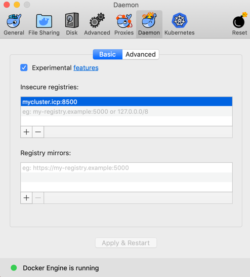
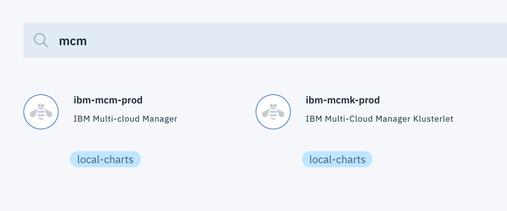
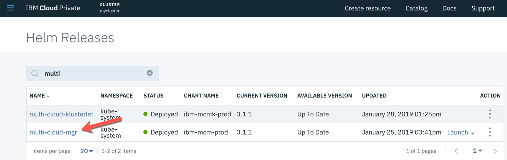
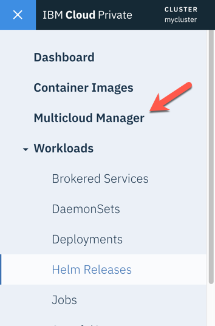
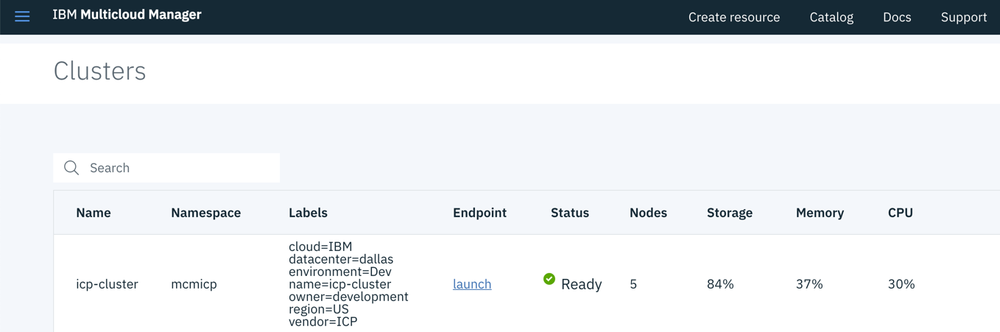
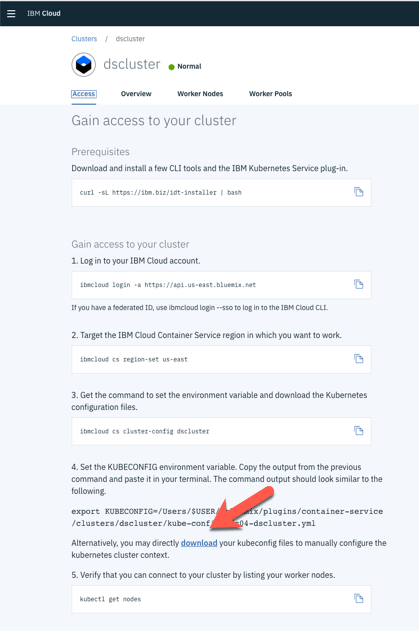
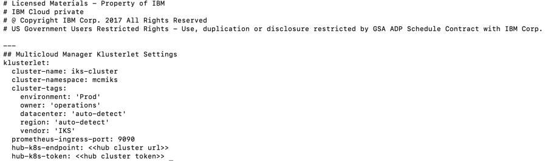
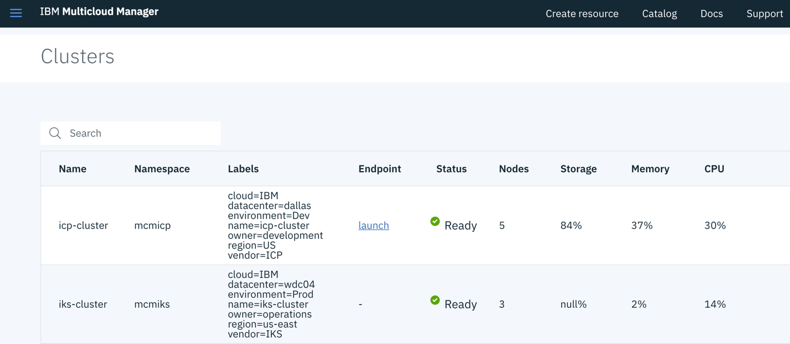

# Installing Multicloud Manager

_**THANK YOU** to Darrell Schrag for contributing this documentation!!_

## Download the tarball

You will need the tarball that contains the MCM images. Depending on your ICP architecture, here are the files you need.

- mcm-3.1.1-amd64.tgz (for x86)
- mcm-3.1.1-ppc64le.tgz (for power)

Both of these files can be found in the **mcm-3.1.1.tgz** tarball file, which is the Installation Package Assembly.

!!! note
    If you are an IBM'er, you can download the install files from the <a href="https://w3-03.ibm.com/software/xl/download/ticket.wss" target="_blank">Software Sellers Workplace</a>. 
    
    You will need to log in and do a search for **_IBM Multi-cloud Manager 3.1.1_**. 
    The package assembly you need to look for is: **IBM Multi-cloud Manager Installation Packages eAssembly  (CJ4NTEN)**

    Download the following part in the assembly:

    IBM Multi-cloud Manager 3.1.1 Kubernetes Images for Linux (CNX22EN)

For the rest of these instructions, we are assuming an x86 architecture.

The following instructions come basically from the Knowledge Center for installing MCM <a href="https://www.ibm.com/support/knowledgecenter/en/SSBS6K_3.1.1/mcm/installing/install.html" target="_blank">https://www.ibm.com/support/knowledgecenter/en/SSBS6K_3.1.1/mcm/installing/install.html</a>

## Prerequisites

The following must be installed on your MacBook as prerequisites for these instructions

- Access to your ICP instance
- Docker
- kubectl
- helm
- IBM Cloud Private CLI (cloudctl)

## Loading the archive

The first step is to get the MCM images into the ICP Docker registry. You need to remotely login to the ICP Docker registry from your laptop. For these instructions a MacBook was used. See the Knowledge Center link above for instructions for Linux.

In order to get access to the remote ICP Docker registry, you need to get an authorization certificate. The certificate authority is located on your master node and is by default named **mycluster.icp**. If you gave it another name when installing then use that name. All of the following instructions assume the certificate authority name is **mycluster.icp**.

Execute these steps be able to login to your ICP Docker registry. Not sure if all of these are necessary.

- First, add your certificate authority (CA) name to your local **/etc/hosts** file.

```bash
<icp-master-ip>  mycluster.icp
```

- Then, on your MacBook create a new directory to store the certificate and copy the cert file down from your CA node

```bash
mkdir -p ~/.docker/certs.d/mycluster.icp\:8500
scp root@mycluster.icp:/etc/docker/certs.d/mycluster.icp\:8500/ca.crt ~/.docker/certs.d/mycluster.icp\:8500/ca.crt
```

- Also, add the cert to your MacBook keychain

```bash
sudo security add-trusted-cert -d -r trustRoot -k /Library/Keychains/System.keychain ~/.docker/certs.d/mycluster.icp\:8500/ca.crt
```

- Add the remote certificate authority as an insecure Docker registry. From the Docker application on the MacBook, select Docker->Preferences. On the Deamon tab, add **mycluster.icp:8500** as an insecure registry. It should look like this.



- Apply and restart Docker

- After all of these steps, you should be able to login to your ICP Docker registry with this command.

```bash
docker login mycluster.icp:8500
```

- Now login to **cloudctl**

```bash
cloudctl login -a https://<master-cluster-ip>:8443 --skip-ssl-validation
```

- From the directory that contains the mcm-3.1.1-amd64.tgz (extracted from the mcm-3.1.1.tgz file), load the archives using the command below. You will see a series of images being loaded into the registry. When done, via your ICP management console, verify that images starting with mcm are now loaded to **Container Images**.

```bash
cloudctl catalog load-ppa-archive -a mcm-3.1.1-amd64.tgz --registry mycluster.icp:8500/kube-system
```
    
- You should also see 2 new MCM entries in the catalog



### Install Multi-cloud Manager

Installing Multi-cloud Manager has many options. Below we will be basically taking the default route. During the installation process it also lets you install the Multi-cloud Manager klusterlet in the same step. We will do that separately.

- Login to your ICP Management Console
- Via the catalog, select the **ibm-mcm-prod** (Multi-cloud Manager) Helm chart
- Click configure
- Specify the following settings
    - For the Helm Release Name, specify any name
    - Select `kube-system` for the Target namespace (very important)
    - Check the License checkbox
    - The Pod Security Box should already be populated. Don't change it.
    - Open the Quick Start parameters twisty
        - Specify `mcm` as the Multicloud Manager namespace
- Click Install

Once installed, you should see the helm release in the Helm Releases list. You should also see Multicloud Manager as a top level entry in the hamberger menu





- You must also create the `mcm` namespace that we specified above.

```bash
cloudctl login -a https://<hub_cluster_host_name>:8443 --skip-ssl-validation
kubectl create namespace mcm
```

### Installing the Multi-cloud Klusterlet in your ICP instance

We need to gather some information to install the Klusterlet (all installations of the MCM Klusterlet require this info).

- Login to the ICP Management console
- Select the user icon, then click **Configure client**. The following kubectl CLI commands are given and they follow this format:

```bash
kubectl config set-cluster {cluster_name} --server={hub_cluster_url} --insecure-skip-tls-verify=true
kubectl config set-context {cluster_name}-context --cluster={cluster_name}
kubectl config set-credentials {cluster_name}-user --token={hub_cluster_token}
kubectl config set-context {cluster_name}-context --user={cluster_name}-user --namespace=default
kubectl config use-context {cluster_name}-context
```

There are two pieces of information we need from above. The first is the **hub_cluster_url** (begins with https and ends in port :8001) and the second is the **hub_cluster_token** (long string). Save these for later steps.

- Login to your ICP Management Console
- Via the catalog, select the **ibm-mcmk-prod** (Multi-cloud Manager Klusterlet) Helm chart
- Click configure
- Specify the following settings:
    - For the Helm Release Name, specify any name
    - Select `kube-system` for the Target namespace (very important)
    - Check the License checkbox
    - The Pod Security Box should already be populated. Don't change it.
    - Open the Quick Start parameters twisty
        - Cluster name: specify a name for the cluster as seen by MCM (example: `icp-cluster` or `dev-cluster`)
        - Cluster namespace: give a unique namespace that MCM will use on the hub cluster for cluster-specific resources (example: `mcm-icp` or `mcm-dev`)
        - Hub Cluster Kubernetes API server: enter the **hub_cluster_url** obtained above
        - Hub Cluster Kubernetes API server token: enter the **hub_cluster_token** obtained above (copy carefully!!)
    - Open the All Paramenters twisty
        - Scroll down and check the **Enable Automatic Generate Tiller Secret** checkbox
        - Scroll down and check the **Deploy to Hub Cluster?** checkbox
        - The following fields are simply labels assigned to the cluster and will be used when matching resources to clusters. Enter what you would like.
            - Cluster Cloud Provider
            - Kubernetes Vendor
            - Cluster Environment Type
            - Cluster Region
            - Cluster Datacenter
            - Cluster Owner
- Click **Local Install**

Once installed, you should see the helm release in the Helm Releases list.

Also, in the ICP Management Console, click the **Multicloud Manager** entry in the left hamberger menu. Once in the Multicloud Manager, select **Clusters** in the left hamberger menu. You should see your cluster present. Notice the labels that we specified during installation.



- Download the MCM CLI. 

The first command downloads the executable **mcmctl** into your current directory. The second one moves it to a directory in your path, like **/usr/local/bin**.

```bash
docker run -e LICENSE=accept -v $(pwd):/data mycluster.icp:8500/kube-system/mcmctl:3.1.1 cp mcmctl-darwin-amd64 /data/mcmctl
mv mcmctl /usr/local/bin
```

### Install the Multi-cloud Klusterlet into an instance of IKS

Installing the MCM Klusterlet into Kubernetes clusters other than ICP will be officially supported in a future release (i.e. 3.1.2), but the following will work. These instructions are obtained from <a href="https://hub.docker.com/r/ibmcom/mcm-inception-amd64" target="_blank">https://hub.docker.com/r/ibmcom/mcm-inception-amd64</a>. The instructions install the CE version of the Klusterlet.

- Run the following command to get the cluster directory from the inception container. The result of this command is that a cluster directory is created in your current directory.

```bash
docker run -v $(pwd):/data -e LICENSE=accept ibmcom/mcm-inception-amd64:3.1.1-ce cp -r cluster /data
```
- Obtain the **kubeconfig** zip file from your IKS cluster. Follow these steps:
    - Log in to the IBM Cloud console (cloud.ibm.com) where you have installed IKS
    - From your list of resources, select your IKS cluster
    - Once on the cluster overview page, select the Access tab
    - Down near the bottom of the Access tab is a **download** link. Click the link to download the kubeconfig file (it is a zip file but does not have an extension)

 

- In the cluster directory created in the first step, copy the newly downloaded **kubeconfig** file ontop of the existing kubeconfig file.

- change directories to the **cluster** directory (if you haven't already)

- Edit the **config.yaml** file to add values to the following properties:
    - cluster-name: the name of the IKS cluster as it will be known by MCM (example: `iks-cluster`)
    - cluster-namespace: the namespace that will be created on the hub cluster for resources specific to the IKS cluster (example: `mcm-iks`)
    - cluster-tags: a list of tags that will be used when assigning resources to this cluster. These are the same tags that we specified when installing the ICP Klusterlet. See the example file below.
    - prometheus-ingress-port: leave as 9090
    - hub-k8s-endpoint: the **hub_cluster_url** we used when installing the ICP Klusterlet
    - hub-k8s-token: the **hub_cluster_token** we used when installing the ICP Klusterlet

- Example **config.yaml** file


- Run the inception container to install the Klusterlet with the following command.

```bash
docker run --net=host -t -e LICENSE=accept -v "$(pwd)":/installer/cluster ibmcom/mcm-inception-amd64:3.1.1-ce install-mcmk-on-iks -v
```

- Back to your MCM console, you should now see the IKS cluster in your clusters list



- Congratulations. You should now have Multi-cloud Manager installed managing your ICP and IKS clusters!!!
